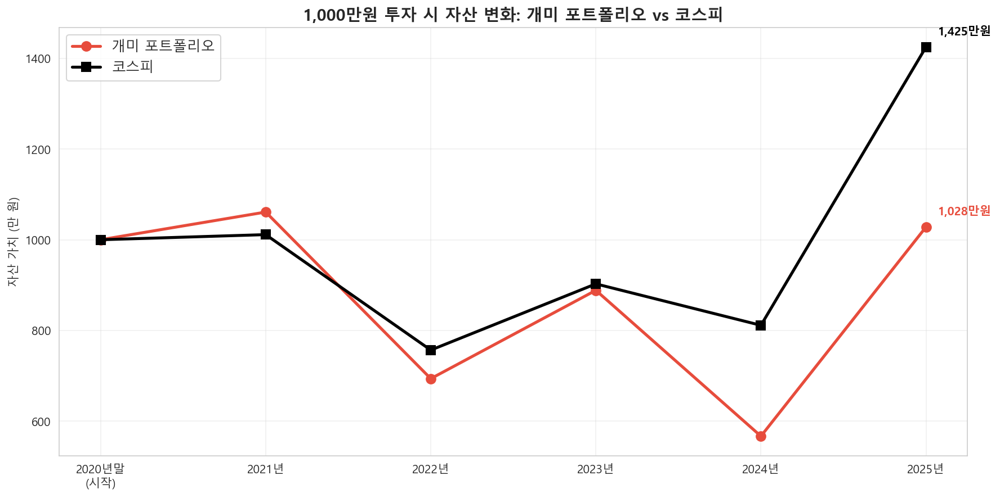
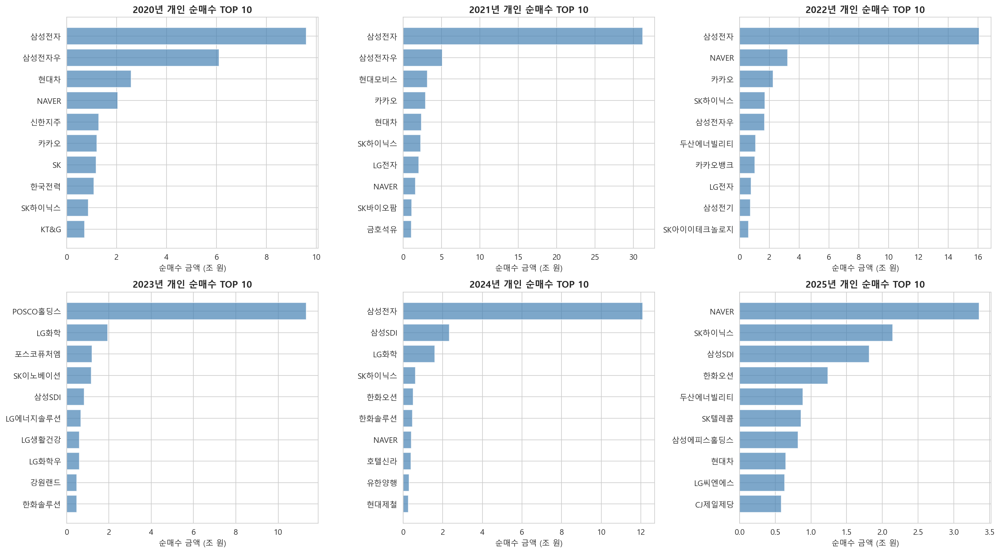

# 동학개미는 정말 이겼을까: 5년치 순매수 데이터의 답

> **2020~2025년 개인 투자자 순매수 상위 종목을 따라 샀다면, 코스피 ETF보다 나았을까?**
> 
> 누적 결과: **개미 추종 전략 +2.8% vs 코스피 +42.5%.** 1,000만원이 6년 후 1,028만원 vs 1,425만원 (격차 27.9%).
> 다만 **paired t-test 결과 p=0.650으로 통계적 유의성은 확보되지 않음** — 5년 표본은 단정에 부족함을 함께 검증.

**개발 기간**: 2026.04

## ▶ 기술 스택

- 언어: Python 3.13
- 데이터 수집: pykrx, yfinance
- 데이터 처리: pandas, numpy
- 시각화: matplotlib, seaborn
- 통계: scipy

---

## ▶ 핵심 요약

이 프로젝트는 **"군중의 선택을 따라가는 투자 전략"의 성과를 정량적으로 검증**합니다. "전년도 개인 순매수 TOP 10을 동일 비중 매수 → 연말 매도" 전략을 5년간 백테스트했습니다.

세 가지 핵심 발견:

1. **누적으로는 코스피에 뒤처짐, 그러나 통계적 유의성은 없음**  
   5년 누적 수익률: 개미 추종 +2.8% vs 코스피 +42.5%. 평균 초과수익률 -3.2%p지만, paired t-test p=0.650으로 유의수준 미달. **숫자상의 격차와 통계적 결론은 다르며, 5년 표본은 "졌다"를 단정하기에 부족.**

2. **비대칭적 리스크가 핵심 패턴**  
   상승장에서 +6.5%p 이기지만, 하락장에서 -17.8%p 짐. 상승장에서 번 것을 하락장에서 약 3배로 토해내는 구조.

3. **고점 추격 매수 패턴 확인**  
   전년도 상승 종목을 다음 해에 매수하는 구조 → 평균 회귀(mean reversion)에 취약. 특히 2024년 -36.2% vs 코스피 -10.1%로 26.1%p 격차.



> 이 프로젝트의 진짜 결과는 "개미가 졌다"가 아니라, **"5년치 데이터로는 단정할 수 없다는 사실 자체"**입니다. 결과의 명확함보다 검증 과정의 정직함이 핵심입니다.

---

## ▶ 핵심 인사이트

1. **표본 크기가 결론의 강도를 제한한다** — 누적 격차 27.9%는 시각적으로 강한 결과지만, paired t-test에서 p=0.650으로 우연일 가능성을 배제할 수 없음. 큰 숫자가 자동으로 강한 결론이 되지 않음을 보여주는 사례.

2. **비대칭 리스크가 누적 수익을 결정한다** — 상승장 승률만 보면 매력적인 전략처럼 보임. 하지만 하락장에서 3배 더 잃는 구조가 누적 수익을 갉아먹음. 투자 전략 평가에서 "잃지 않는 것"이 "버는 것"보다 결정적임을 시사.

3. **고점 추격 매수의 메커니즘** — 전년도 상승 종목이 다음 해 순매수 1위가 되는 구조 → 평균 회귀 위험에 직접 노출. 2024년 개미 추종 전략 -36.2% vs 코스피 -10.1%가 대표 사례.

4. **인기 ≠ 좋은 종목, 군중 지표는 역지표가 될 수 있다** — 6년 중 4년의 순매수 1위가 삼성전자였지만, 6년 누적으로는 코스피 미달. 군중의 선택을 따르는 전략은 시기 선택에 극도로 민감하며, 변동성도 큼 (5년 종목별 TOP/BOTTOM이 대부분 2025년 한 해에 몰림).

---

## ▶ 분석 흐름

### 1. 데이터 수집 (`1_data_collection.ipynb`)
- KRX 정보데이터시스템에서 연도별 개인 순매수 상위 종목 다운로드
- pykrx로 67개 종목의 일별 주가 (OHLCV) 수집
- yfinance로 코스피 지수 수집
- 데이터 품질 점검 + 백테스트 안전성 사전 검증

### 2. 탐색적 분석 (`2_eda.ipynb`)
- 연도별 순매수 금액 분포 및 집중도 분석
- 개미 인기 종목의 코스피 대비 주가 추이
- 연도별 상위 5종목의 코스피 초과수익률 개별 확인
- 종목 등장 빈도 분석 (꾸준히 사는 종목 vs 1회성 종목)

### 3. 백테스트 (`3_backtest.ipynb`)
- **전략**: 전년도 순매수 상위 10종목을 동일 비중으로 매수, 연말 매도
- **벤치마크**: 코스피 지수
- 연간 수익률 및 누적 수익률 비교
- 상승장/하락장 구분 성과 분석
- 종목별 최대 초과수익/손실 분석
- **paired t-test로 통계적 유의성 검정**

### 4. 종합 결론 (`4_conclusion.ipynb`)
- 가설 vs 실제 결과 정리
- 한계점 및 향후 개선 방향

> **데이터 검증**: 분석 시작 전 세 가지 잠재 위험을 사전 점검 — (1) 결측치 14건은 신규 상장 첫날 등락률 NaN뿐 (종가 정상), (2) 신규 상장주가 백테스트 시작점에 영향 준 사례 0건, (3) 종목코드 매칭 100%. 검증 코드는 1번 노트북에 포함.

---

## ▶ 주요 결과

### 개미 추종 전략 vs 코스피 (연간 성과)

| 보유연도 | 개미 추종 | 코스피 | 초과수익 | Hit Ratio |
|---------|-----:|------:|--------:|-----:|
| 2021 | +6.1% | +1.1% | +5.0%p | 4/10 |
| 2022 | -34.6% | -25.2% | -9.4%p | 2/10 |
| 2023 | +28.1% | +19.3% | +8.8%p | 5/10 |
| 2024 | -36.2% | -10.1% | -26.1%p | 1/10 |
| 2025 | +81.4% | +75.7% | +5.8%p | 3/10 |
| **평균** | **+9.0%** | **+12.2%** | **-3.2%p** | **3/10** |

> Hit Ratio: 포트폴리오 10종목 중 코스피를 초과한 종목 수.

### 통계적 유의성 검정

5년 표본의 평균 차이가 우연이 아닌지 paired t-test로 검정:

| 항목 | 값 |
|---|---:|
| 표본 크기 | n = 5년 |
| 평균 초과수익률 | -3.20%p |
| t-statistic | -0.490 |
| **p-value** | **0.650** |

**해석**: p ≥ 0.05이므로 5% 유의수준에서 개미 추종 전략과 코스피의 차이가 통계적으로 유의하지 않음. **누적 격차 27.9%는 시각적으로 크지만, 5년 표본만으로는 "개미 추종 전략이 코스피에 진다"를 단정할 수 없음.** 본 분석은 결정적 증거(proof)가 아닌 검증된 가설(validated hypothesis)로 해석해야 함.

### 시장 상황별 성과 (비대칭 리스크)

| 시장 상황 | 평균 초과수익 | 연수 |
|----------|----------:|-----:|
| 상승장 | +6.5%p | 3년 |
| 하락장 | -17.8%p | 2년 |

→ 상승장 우위(+6.5%p)보다 하락장 손실(-17.8%p)이 약 3배 큼. 표본 한계와 별개로 **이 비대칭 패턴 자체는 일관됨**.

### 순매수 집중도

- 삼성전자가 6년 중 4년 순매수 1위
- 상위 5종목 집중도: 57~81%
- NAVER, SK하이닉스: 5년 연속 상위 20 등장



### 종목별 극단 성과 (변동성 시사)

5년간 코스피 대비 가장 크게 이긴 / 진 종목 TOP 5는 **대부분 2025년 한 해에 몰림** — 상위 5개 중 4개가 2025년, 하위 5개 중 4개가 2025년. 군중 추종 전략의 변동성이 매우 큼을 보여줌.

---

## ▶ 가설 vs 실제 결과

| 항목 | 사전 가설 | 실제 결과 |
|---|---|---|
| 개미 상위 종목 vs 코스피 | 시기 의존적일 것 | 맞음. 상승장 +6.5%p, 하락장 -17.8%p |
| 개미는 고점에서 살 것 | 가능성 높음 | 맞음. 전년도 상승 종목 추격 매수 → 평균 회귀에 취약 |
| 시기별 결론이 다를 것 | 그럴 것 | 맞음. 2021/2023/2025 승리, 2022/2024 대패 |
| 전체적으로 코스피를 이길 것 | 열린 질문 | 누적으로는 짐(-27.9%). 단, **통계적 유의성 없음 (p=0.650)** |

---

## ▶ 한계점

- **표본 5년은 통계적 유의성 확보에 부족** — paired t-test p=0.650. 추가 표본 기간 확보가 가장 큰 우선순위.
- KRX 순매수 데이터는 연간 집계로, 월별/분기별 변화를 반영하지 못함
- KOSPI만 분석, KOSDAQ 미포함
- **거래 비용(수수료, 증권거래세) 미반영** — 연 1회 리밸런싱 가정 시 누적 약 4~5% 비용 추가 발생. 반영 시 개미 추종 전략의 손실 폭이 더 커짐.
- 배당 수익 미반영 (종가 기준 수익률만 계산)
- 동일 비중 가정은 실제 개인 투자자의 투자 행태와 다를 수 있음
- **본 분석은 "순매수 상위 종목을 따라가는 전략"의 성과이며, 개인 투자자 전체의 실제 수익률과는 다름**

---

## ▶ 향후 개선 방향

- **2015~2019년 데이터 추가로 표본 기간 확대** — 통계적 유의성 확보가 최우선
- 월별 리밸런싱 전략으로 재구성
- KOSDAQ 포함 분석
- 역발상 전략: 개미 순매도 상위 종목(=기관/외국인 순매수)의 성과 비교
- 배당 반영 총수익률(Total Return) 재계산
- 위험 조정 수익률(Sharpe Ratio) 비교

---

## ▶ 파일 구조

```
donghakgaemi-analysis/
├── notebooks/
│   ├── 1_data_collection.ipynb     # 데이터 수집 + 안전성 검증
│   ├── 2_eda.ipynb                 # 탐색적 분석
│   ├── 3_backtest.ipynb            # 백테스트 (핵심)
│   └── 4_conclusion.ipynb          # 종합 결론
├── data/
│   ├── net_purchases_20XX.csv      # KRX 원본 (연도별)
│   ├── top_stocks.csv              # 순매수 상위 종목
│   ├── prices.csv                  # 종목별 일별 주가
│   └── kospi.csv                   # 코스피 지수
├── images/
│   ├── cumulative_returns.png      # 누적 수익률 비교
│   ├── yearly_top10.png            # 연도별 순매수 TOP 10
│   └── price_comparison.png        # 코스피 vs 인기종목 추이
├── .gitignore
└── README.md
```

---

## ▶ 사용 데이터 출처

| 데이터 | 출처 | 규모 |
|---|---|---|
| 개인 투자자 순매수 상위 종목 | [KRX 정보데이터시스템](http://data.krx.co.kr) | 6년 × ~950종목 |
| 종목별 일별 주가 (OHLCV) | [pykrx](https://github.com/sharebook-kr/pykrx) | 89,174행, 67종목 |
| 코스피 지수 | [Yahoo Finance](https://finance.yahoo.com) | 1,471일 |

분석 기간: **2020.01 ~ 2025.12 (6년)** | 백테스트 보유 연도: 2021~2025